## Install Grafana

**Introduction**
 Grafana is open-source software famous for creating graphs and visualizations for end-users to articulate the time-series data. In this tutorial, we will focus on the following steps and it will carry out on an EC2 Instance with Amazon Linux 2 as the operating system
- Provisioning Ec2 server
- Installation of Grafana
- Testing the setup
- Adding Data Source in the Grafana
- Testing CloudWatch as a Data Source

**Step 1 - Provisioning Ec2 server**
  
  - Launch an Amazon Linux 2 AMI EC2 Instance with the below configuration
  
       - AWS AMI for Ec2 
       
       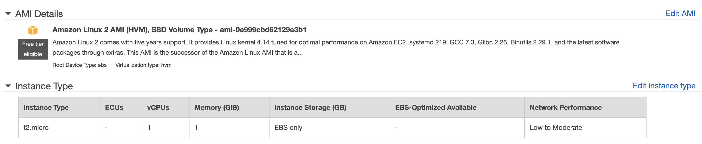
       
       - Security Group for Ec2 
       
       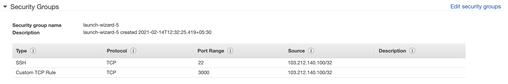
       
       *Note: Avoid opening port to anywhere i.e. 0.0.0.0/0*
       
       - IAM policy for Ec2 
       
       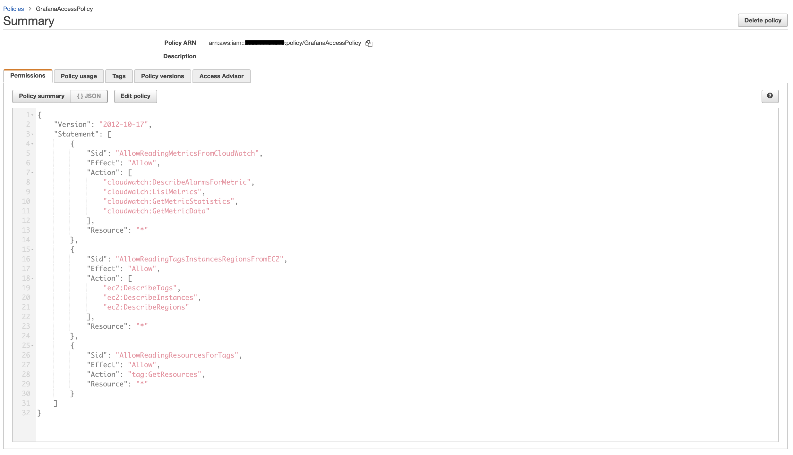
       
       - Storage & Tags for Ec2 
       
       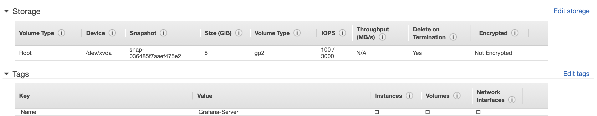
       
       - Let's verify if Ec2 is deployed successfully 
       
       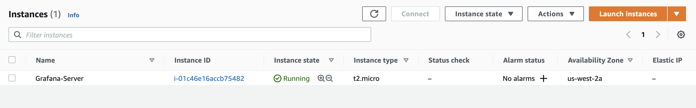
       

**Step 2 - Installation of Grafana**

   - SSH into your Ec2 instance  
    
    ssh -i "<pemfile_name>" ec2-user@publicdns_of_ec2
    
   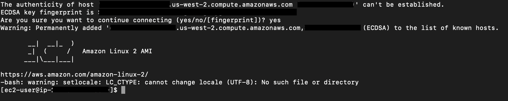
   
   - Now let's update all installed packages in the Ec2 instance
   
    sudo yum update -y
    
   - Now we will add a new entry in the YUM repository to download Grafana

    sudo vi /etc/yum.repos.d/grafana.repo
   
   - Copy the below lines and paste as is in the grafana.repo
   
    [grafana]
    name=grafana
    baseurl=https://packages.grafana.com/oss/rpm
    repo_gpgcheck=1
    enabled=1
    gpgcheck=1
    gpgkey=https://packages.grafana.com/gpg.key
    sslverify=1
    sslcacert=/etc/pki/tls/certs/ca-bundle.crt
    
   - Finally, we are ready to install Grafana
   
    sudo yum install grafana -y
    
   - Reload the systemd to load the new settings. Start Grafana Server, then check for its status
   
    sudo systemctl daemon-reload
    
   - Start the Grafana Server

    sudo systemctl start grafana-server
    
   - Check the status of Grafana Server

    sudo systemctl status grafana-server
  
   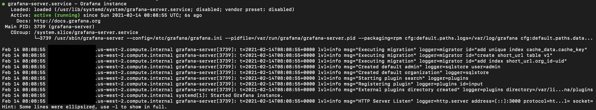
   
   - Run the command below to make sure that Grafana will start upon booting our Amazon Linux 2 instance
   
    sudo systemctl enable grafana-server.service

**Step 3 - Testing the setup**

   - Enter the Public DNS of Ec2 instance with port 3000 in the browser and it will redirect you to the login screen of Grafana
   
   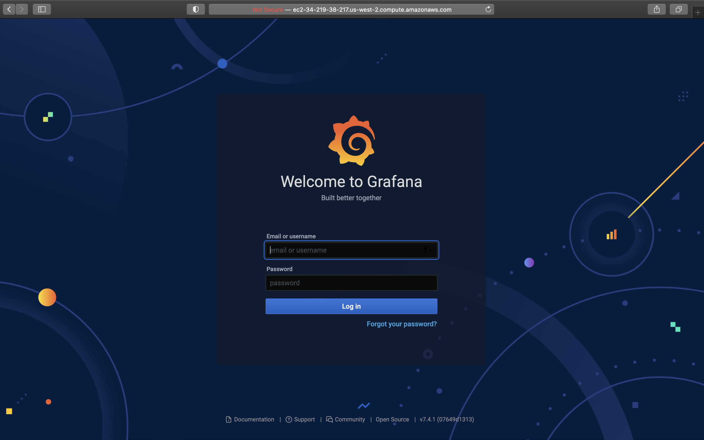
   
   - Default username & password will be admin and on the first login, Grafana will require to change the admin password 
   
   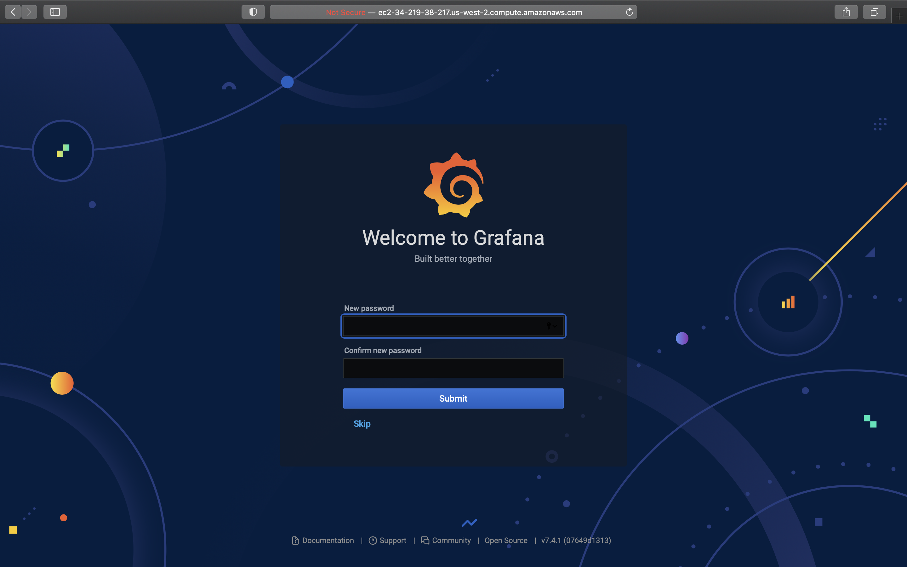
   
   - Now you will move to the default Welcome Grafana page and here we can add Data Sources, Dashboards, Users or Explore plugins and many more
   
   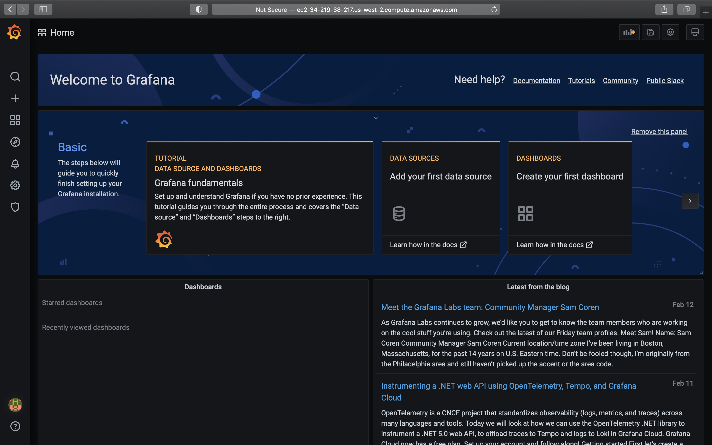
   
   - We have now successfully installed Grafana on EC2 Instance running in Amazon Linux 2
   
   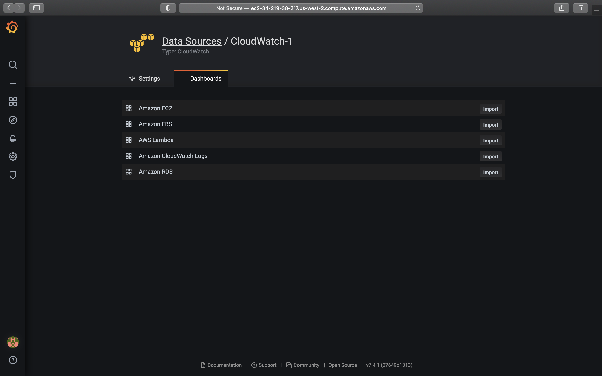
   
**Step 4 - Adding Data Source in the Grafana**

   - Click on Configuration >> Data Sources
   
   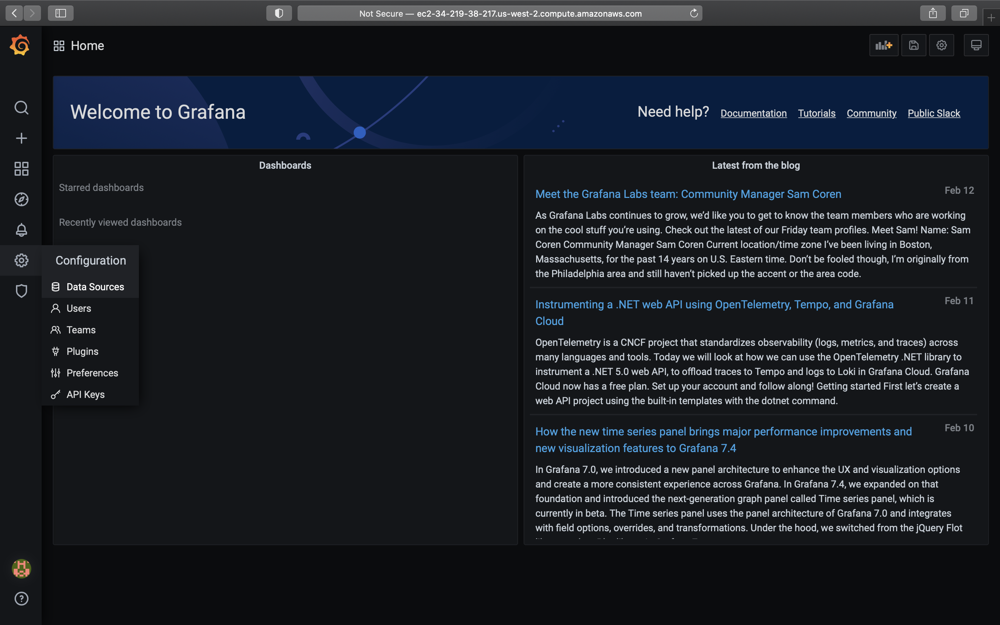

   - Click on Add data source.
   
   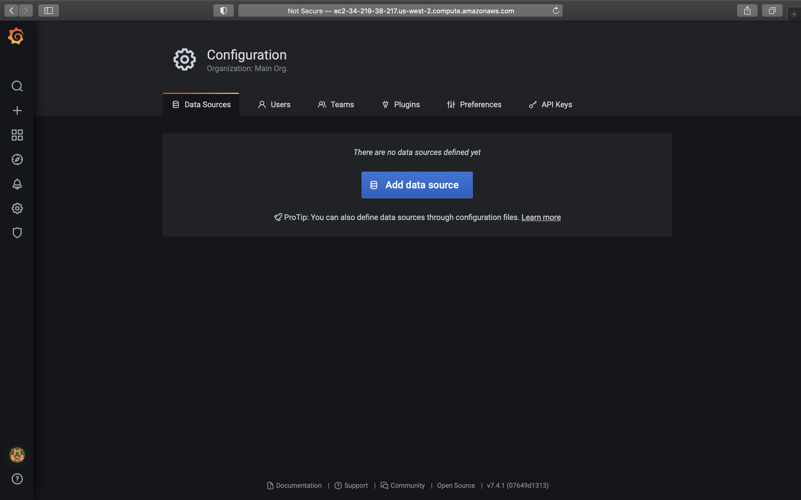
   
   - Search for CloudWatch and click Select
   
   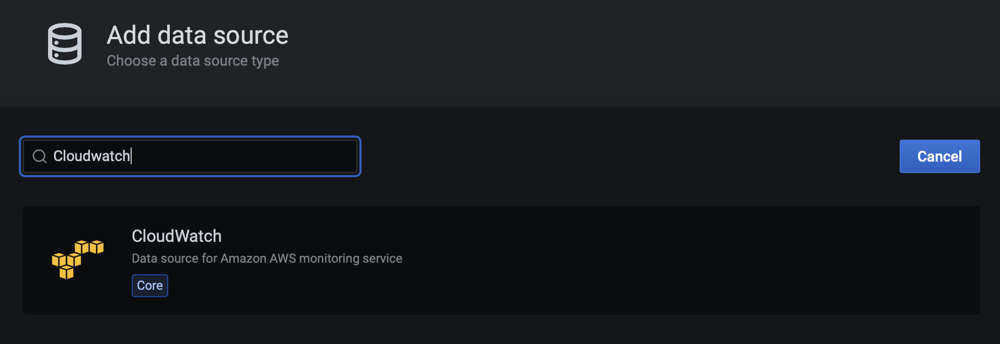
   
   - Under CloudWatch settings, add Name and Default Region. Then click Save & Test.
   
   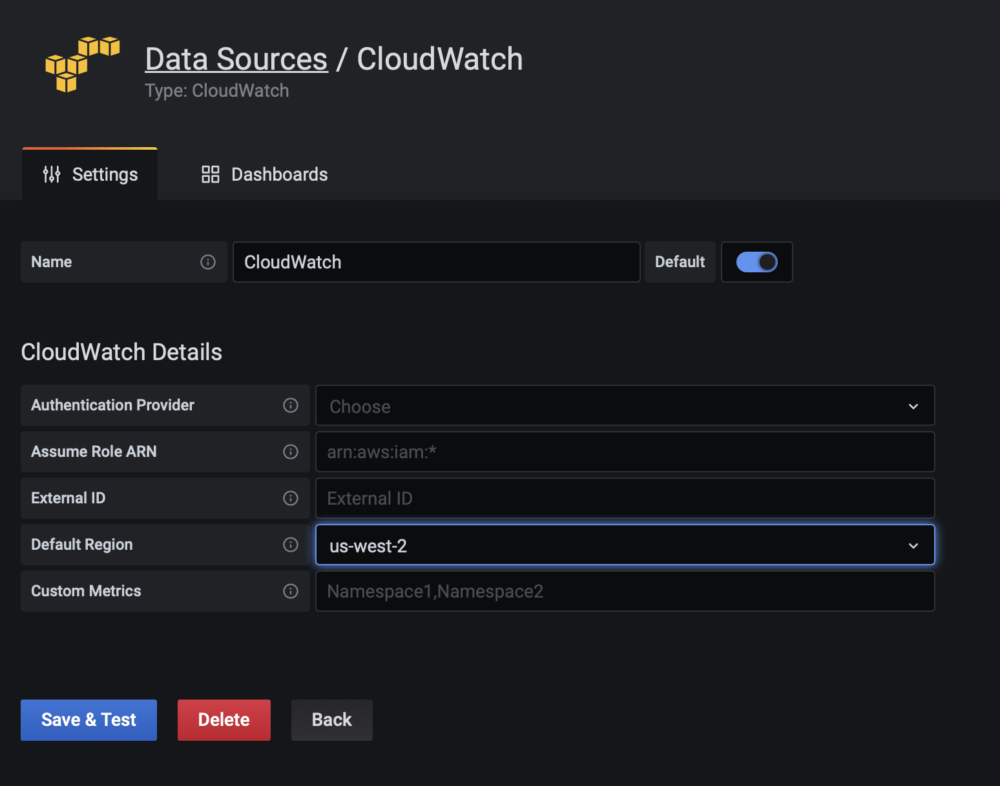
   
   *Note: You can also use the following Auth Provider to access CloudWatch via IAM Role.*
   
   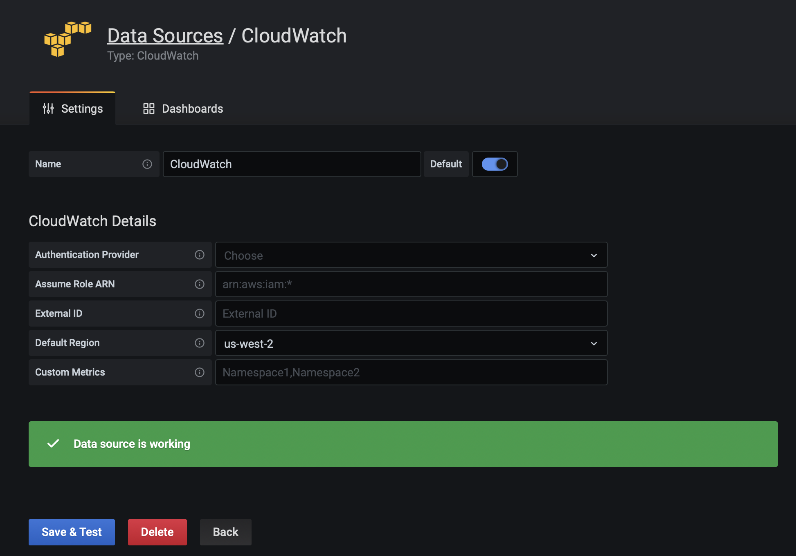
   
**Step 5 - Testing CloudWatch as a Data Source**
    
   - Let's create a new dashboard with Cloudwatch as a source
   
   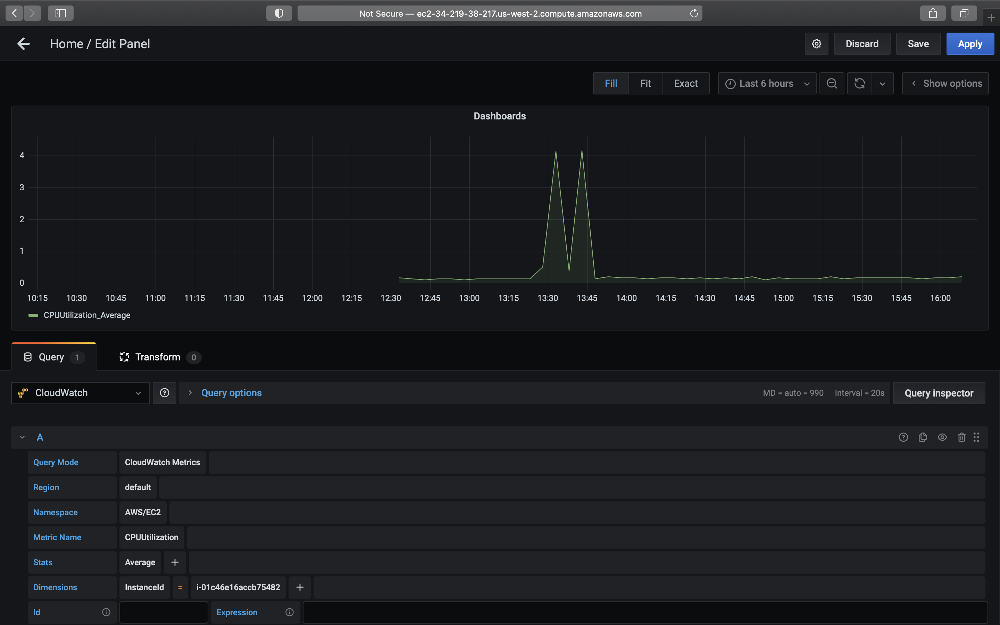
   
   - Green spike on the Graph means Grafana Server can successfully access CloudWatch via the attached IAM Role of the EC2 Instance.
